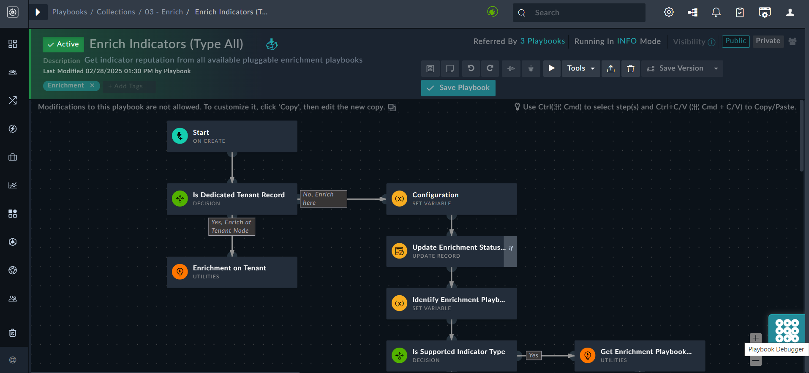
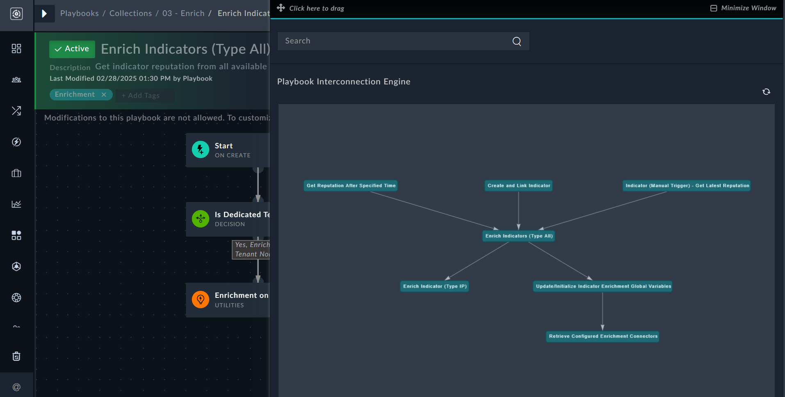
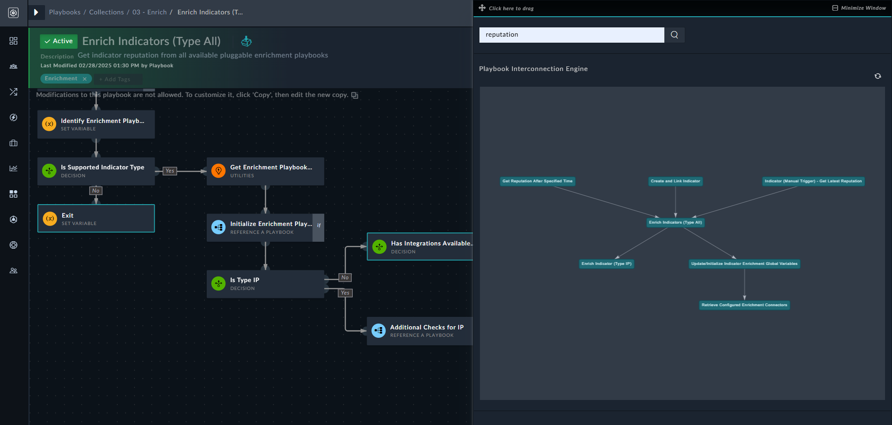

| [Home](../README.md) |
|----------------------|

# Usage

The Playbook Debugger Widget adds the **Playbook Debugger** icon to the lower-right corner of the playbook designer. This tool provides a comprehensive view of playbook relationships, making it easier to navigate interconnected and nested playbooks through a visual tree structure.

To view the playbook relationships, open a playbook in the designer and click the **Playbook Debugger** icon, located in the lower-right corner of the screen:

 

Clicking the **Playbook Debugger** icon opens the 'Playbook Interconnection Engine', which displays how playbooks are interconnected and referenced: 

 

This feature allows users to view these relationships directly, making it easier to build complex playbooks without having to navigate away from the current playbook, find the referenced playbook, and return to the original one. It also aids in debugging and understanding the complete workflow. Additionally, you can click any related playbook to open it for further inspection.

The **Search** box enables users to search for text, including variables, step names, and more. When a match is found in any step within a playbook, those steps are highlighted in the playbook designer. For example, searching for `reputation` in the sample playbook, `Enrich Indicators (Type All)` highlights steps such "Exit" (Set Variable step), "Has Integration Available" (Decision step), and others: 

 

## Next Steps

| [Installation](./setup.md#installation) | [Configuration](./setup.md#configuration) |
| --------------------------------------- | ---------------------------------------- |
|                                         |                                          |